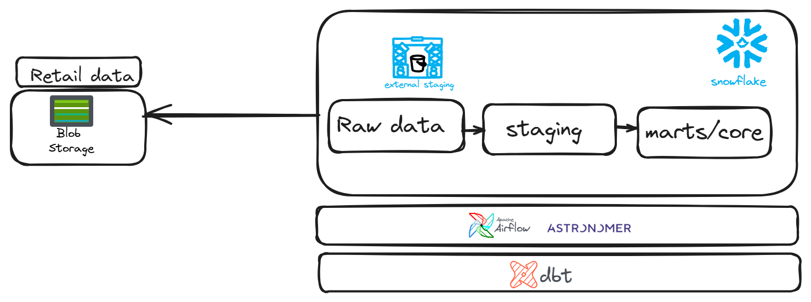

# Pipeline de Données Retail - Solution ELT avec Astro

Ce projet est une solution ELT complète pour traiter les données retail d'un client, répondant aux exigences d'un test technique de Data Engineer. Le pipeline est implémenté avec Astro (Airflow), automatisé avec Makefile, et déployé sur Astronomer Cloud.

## Objectif du projet

Traiter les données retail fournies par un client et produire quatre tables dimensionnelles dans Snowflake:
1. `dim_clients` : Dimension des clients (avec account_id)
2. `dim_products` : Dimension des produits
3. `dim_stores` : Dimension des magasins (avec latitude/longitude)
4. `fct_transactions` : Table de faits des transactions (avec account_id et timestamp)

## Architecture technique

Le pipeline est composé de trois parties principales :
1. **Ingestion (E+L)** : Extraction des données depuis Azure Blob Storage et chargement dans Snowflake (Python)
2. **Transformation (T)** : Modèles dbt pour transformer les données en modèles dimensionnels
3. **Orchestration** : DAGs Airflow pour orchestrer l'ensemble du pipeline

### Architecture



## Prérequis

- [Astro CLI](https://docs.astronomer.io/astro/cli/install-cli)
- Docker et Docker Compose
- Make

### Installation d'Astro CLI

Pour Linux :
```bash
curl -sSL install.astronomer.io | sudo bash -s
```

Pour macOS :
```bash
brew install astro
```

Pour Windows, veuillez consulter la [documentation officielle](https://docs.astronomer.io/astro/cli/install-cli).

## Guide d'utilisation

### 1. Initialisation du projet

```bash
# Cloner le projet
git clone <repository-url>
cd <repository-directory>

# Configurer les variables d'environnement
# Modifiez le fichier .env avec vos informations de connexion à Snowflake et Azure Blob Storage
```

### 2. Démarrage de l'environnement Astro

```bash
# Démarrer l'environnement Astro avec Astro CLI
astro dev start

# Ou utiliser le Makefile (qui utilise Astro CLI en arrière-plan)
make start
```

### 3. Exécution du pipeline

Vous avez plusieurs options pour exécuter le pipeline:

#### Option 1: Exécution via le Makefile

```bash
# Exécuter le pipeline complet (ingestion + transformation)
make pipeline

# Ou exécuter les étapes individuellement
make ingestion
make dbt-transform
```

#### Option 2: Exécution via l'interface Airflow

```bash
# Accéder à l'interface web d'Airflow à http://localhost:8080
# Utilisateur: admin, Mot de passe: admin

# Déclencher manuellement le DAG retail_pipeline
```

## Structure du projet

```
.
├── Dockerfile             # Définition de l'image Docker
├── Makefile               # Commandes pour exécuter le pipeline
├── packages.txt           # Packages système à installer
├── requirements.txt       # Dépendances Python
├── dags/                  # DAGs Airflow pour l'orchestration
│   ├── ingestion_dag.py   # DAG pour l'ingestion des données
│   ├── dbt_transform_dag.py # DAG pour les transformations dbt
│   └── retail_pipeline_dag.py # DAG pour le pipeline complet
├── ingestion/             # Code d'extraction et de chargement
│   ├── el/                # Modules d'ingestion par type de données
│   ├── utils/             # Utilitaires partagés
│   └── tests/             # Tests unitaires et d'intégration
└── dbt/                   # Projet dbt pour la transformation
    └── retail_transform/  # Projet dbt principal
        ├── models/        # Modèles dbt (staging et core)
        └── tests/         # Tests de validation des données
```

## Tests et qualité du code

```bash
# Installer les dépendances de test
make install-test-deps

# Exécuter tous les tests
make test

# Exécuter les tests unitaires uniquement
make test-unit

# Exécuter les tests d'intégration uniquement
make test-integration

# Exécuter les tests avec couverture de code
make test-coverage

# Exécuter les tests des DAGs
make test-dags
```

## Commandes utilitaires

```bash
# Afficher l'aide
make help

# Démarrer l'environnement Astro
make start

# Arrêter l'environnement Astro
make stop

# Redémarrer l'environnement Astro
make restart

# Afficher le statut de l'environnement Astro
make status

# Se connecter au conteneur webserver
make bash
```

## Commandes dbt

```bash
# Nettoyer les fichiers dbt
make dbt-clean

# Installer les dépendances dbt
make dbt-deps

# Exécuter les modèles staging
make dbt-run-staging

# Tester les modèles staging
make dbt-test-staging

# Exécuter les modèles core
make dbt-run-core

# Tester les modèles core
make dbt-test-core

# Exécuter toutes les transformations dbt
make dbt-transform
```

## Détails techniques

### Ingestion des données

Le module d'ingestion extrait les données depuis Azure Blob Storage et les charge dans Snowflake. Il gère:
- Les fichiers de référence (clients, produits, magasins)
- Les fichiers de transactions quotidiens

### Transformation des données

Les modèles dbt transforment les données brutes en modèles dimensionnels:
- Modèles de staging pour nettoyer et préparer les données
- Modèles core pour créer les tables dimensionnelles finales

### Orchestration avec Airflow

Trois DAGs Airflow sont disponibles:
- `retail_ingestion` : Ingestion des données depuis Azure Blob Storage vers Snowflake
- `retail_transform` : Exécution des transformations dbt
- `retail_pipeline` : Pipeline complet combinant ingestion et transformation

Le DAG principal (`retail_pipeline`) est configuré pour s'exécuter quotidiennement à 10h00 et orchestre l'ensemble du pipeline:
- Ingestion des données de référence en parallèle
- Ingestion des transactions
- Exécution des transformations dbt
- Tests de validation des données

### Déploiement sur Astronomer Cloud

Ce projet est déployé sur Astronomer Cloud, la plateforme managée d'Astronomer pour Apache Airflow. Le déploiement sur Astronomer Cloud offre plusieurs avantages :

- Infrastructure gérée et hautement disponible
- Mise à l'échelle automatique des ressources
- Surveillance et alertes intégrées
- Gestion simplifiée des secrets et des variables d'environnement
- Interface utilisateur conviviale pour la gestion des déploiements

Je pourrais faire une demo si vous le souhaiter. 
Toutefois, je vous ai envoyé un lien permettant d'accéder aux Dags, mais vous devez avoir un compte astronomer pour y accéder rien de plus simple que d'en créer un sur https://cloud.astronomer.io
